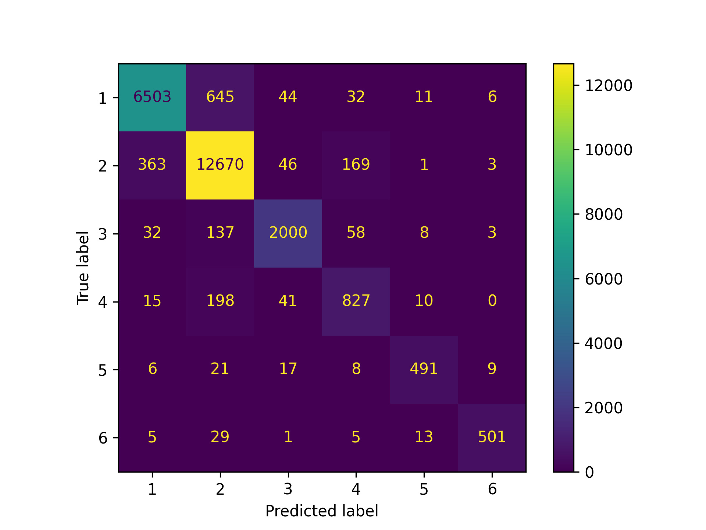

# Extracting Bethesda score from PALGA with Fuzzy String Matching

The Bethesda score is not always tracked in PALGA or at least has not
always been tracked. To circumvent this issue, we can leverage the `Conclusie` texts
that are typically found in PALGA.

We apply fuzzy string matching to find words that are close to `Bethesda score`,
`Bethesda classificatie`, etc. Then, we extract the bethesda score from these close words.

### Usage
To run the main algorithm, make sure that you have a dataset that contains
at least the `Conclusie` column. This is needed to extract the Bethesda scores from.
Then, simply run the following cli command:

```bash
python main.py --path "my_data.csv" --output "my_results.csv"
```

If you want to have an interactive example, you can run the notebooks in `/notebooks` for a full overview including exploration steps.


# Procedure description

The conclusion texts form the pathologists were provided in semi-structured free-text fields. To extract Bethesda scores from those free-text fields, a combination of fuzzy string matching and machine learning techniques were used.

Initially, PolyFuzz and RapidFuzz were used to identify and extract Bethesda scores by employing matching algorithm to find text segments closely resembling predefined keywords and phrases related to Bethesda scores, such as "Bethesda" and "Bethesda cat II", including phrases with spelling errors. 

The phrases in the free-text fields were compared with the predefined phrases based on their textual similarity. This similarity is defined by the normalized Levenshtein distance (values between 0 and 1) between phrases. For each record, the phrase in the free-text field with the highest similarity to any one of the predefined phrases was extracted. This procedure maximizes the likelihood of extracting phrases with high similarity scores. 

To further reduce the likelihood of false positives, a minimum similarity threshold of .8 was set to extract only high-confidence matches. From these resulting phrases, like "Bethesda klasse 2", the actual score (2) was extracted. As the text fields were semi-structured, we found that the score would always be at the end of the given phrase. The threshold of .8 was chosen through two methods. First, manual exploration of the data allowed for quickly viewing whether the output matched the rather short free-text fields. Second, if the wrong phrases were selected we would get an error when extracting the actual score as no integers could be extracted.

Using this procedure, a Bethesda score could not be extracted in 30.9% of cases. The number of reports including the Bethesda score increased over time, from 3.5% in 2010 to 95.2% in 2021. 

For cases in which the Bethesda score was not extracted via fuzzy string matching, a predictive model based on Term Frequency-Inverse Document Frequency (TF-idf) and logistic regression was utilized. TF-IDF was used to transform the text data into numerical feature vectors, capturing the importance of words in the context of the documents. The logistic regression model was then trained using the Bethesda scores previously extracted by PolyFuzz and RapidFuzz as training labels. 

This model predicted the Bethesda scores in the remaining documents based on the open text, thereby complementing the initial extraction process and improving overall coverage. 

Using 5-fold cross validation, the performance of the model was evaluated on the data extracted through fuzzy string matching. The results showed a macro F1-score of .89 and a micro F1-score of .92. 

To further explore the model's performance across classes, a classification report was created by training the model on 70% of the excerpts which included a Bethesda score and validated on the remaining of those excerpt.

```
               precision    recall  f1-score   support

         1.0       0.94      0.90      0.92      7241
         2.0       0.92      0.96      0.94     13252
         3.0       0.93      0.89      0.91      2238
         4.0       0.75      0.76      0.76      1091
         5.0       0.92      0.89      0.90       552
         6.0       0.96      0.90      0.93       554

    accuracy                           0.92     24928
   macro avg       0.90      0.88      0.89     24928
weighted avg       0.92      0.92      0.92     24928
```

These results demonstrate the cause of the difference between the macro and micro scores, namely that a Bethesda score of 4 is relatively difficult to predict.

To find the cause of this difference, a confusion matrix was created.



This matrix indicates that that Bethesda score 4 is often confused with Bethesda score 2.

**NOTE**: Other models, including Random Forest and XGBoost were explored but were found to have similar scores. Random Forest showed macro and micro F1-scores of 0.88 and 0.92 respectively. XGBoost showed macro and micro F1-scores of 0.89 and 0.93 respectively. A logistic regression was chosen as it is most interpretable of these techniques and has similar performance.

```
# Random Forest
               precision    recall  f1-score   support

         1.0       0.94      0.91      0.92      7241
         2.0       0.93      0.96      0.94     13252
         3.0       0.94      0.89      0.91      2238
         4.0       0.77      0.75      0.76      1091
         5.0       0.92      0.90      0.91       552
         6.0       0.94      0.91      0.92       554

    accuracy                           0.93     24928
   macro avg       0.91      0.89      0.90     24928
weighted avg       0.93      0.93      0.93     24928
```

```
# XGBoost
               precision    recall  f1-score   support

           0       0.94      0.91      0.93      7241
           1       0.93      0.96      0.94     13252
           2       0.93      0.90      0.91      2238
           3       0.76      0.77      0.77      1091
           4       0.91      0.91      0.91       552
           5       0.94      0.92      0.93       554

    accuracy                           0.93     24928
   macro avg       0.90      0.89      0.90     24928
weighted avg       0.93      0.93      0.93     24928
```
